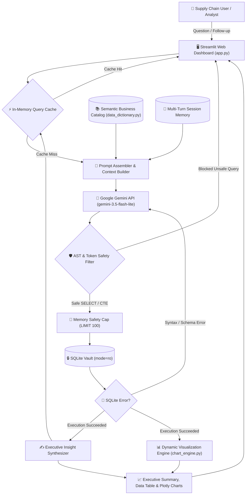

# 🤖 Tele-Tron-1: System Architecture & Design Specification

A comprehensive technical architecture document for **Tele-Tron-1**, an enterprise-grade autonomous Natural Language to SQL (NL-to-SQL) intelligence engine for supply chain and freight logistics.

---

## 🏗️ 1. End-to-End System Architecture

---

## 🖼️ 2. Architectural Narrative in Hand-Drawn Illustrations

Tele-Tron-1 processes user queries through a 4-stage pipeline illustrated below:

### Stage 1: Data Ingestion — Raw Sensor Telemetry to Read-Only Vault

* **The Challenge:** High-frequency, noisy telematics streams (GPS tracking coordinates, cold-chain temperature readings, fuel consumption gauges, and traffic congestion indexes) pour into the logistics system.
* **The Process:** Raw sensor records are indexed and stored inside SQLite. The database connection is wrapped in a strict C-engine read-only lock (`mode=ro`).
* **Why It Matters:** Destructive operations (`DROP`, `DELETE`, `UPDATE`, `INSERT`, `ALTER`) are physically impossible at the database engine level, safeguarding data integrity against both accidents and malicious prompts.

---

### Stage 2: Security Gatekeeper — Dual-Tier Query Protection

* **The Challenge:** LLMs can be tricked by prompt injection, stacked commands (e.g. `SELECT 1; DROP TABLE...`), or administrative exploits (`ATTACH`, `PRAGMA`).
* **The Process:** Every proposed query passes through an Abstract Syntax Tree (AST) & regex token validator before touching the database connection:
  * Verifies the query begins strictly with `SELECT` or `WITH` (for Common Table Expressions).
  * Strips comments and string literals to prevent token obfuscation while allowing legitimate words within quotes (e.g., `'updated'`, `'drop'`).
  * Intercepts multi-statement semicolons, DDL, and DML keywords.
* **Why It Matters:** Blocks dangerous execution before a connection is ever established.

---

### Stage 3: Query Generation — Semantic Catalog & Self-Correction Engine

* **The Challenge:** Raw database columns (`eta_variation_hours`, `fatigue_monitoring_score`, `risk_classification`) lack business context. Without domain semantics, models guess at definitions and produce inconsistent results.
* **The Process:**
  * **Semantic Business Catalog ([data_dictionary.py](data_dictionary.py)):** Injects precise definitions, units (`USD`, `Days`, `Hours`, `°C`), valid ranges, and domain rules (e.g. `'Low Risk'`, `'Moderate Risk'`, `'High Risk'`).
  * **Self-Correction Loop:** If SQLite throws an `OperationalError` (such as a column typo or aggregation mismatch), Tele-Tron-1 captures the error and passes it back to Gemini for automated repair (up to 2 retry attempts).
* **Why It Matters:** Guarantees mathematically consistent queries and autonomous recovery from edge-case syntax failures.

---

### Stage 4: Synthesis — Memory Safety Cap & Executive Synthesizer

* **The Challenge:** Unbounded queries returning 50,000+ rows freeze browser UIs, consume bandwidth, and overwhelm human reviewers.
* **The Process:**
  * **Memory Safety Cap:** Queries are inspected for `LIMIT` clauses. Open-ended queries automatically receive an injected `LIMIT 100`, while oversized limits are capped at `500` rows maximum.
  * **Insight Synthesizer:** Tabular results are passed through a second synthesis pass that outputs key metric callouts, comparisons, and actionable findings.
  * **Business Assumptions Callout:** Every response explicitly states the analytical assumptions applied during query generation.
* **Why It Matters:** Stakeholders get immediate business answers without manually sifting through thousands of raw records.

---

## 🧩 3. Core Component Breakdown

| Module | Responsibility | Key Functions / Classes |
| :--- | :--- | :--- |
| **[`askdata.py`](askdata.py)** | Core query engine, AST safety filter, self-correction, query caching, and LLM orchestration. | `ask_database()`, `generate_sql()`, `synthesize_answer()`, `is_safe_query()`, `enforce_safety_limit()`, `QueryResult`, `clear_query_cache()` |
| **[`chart_engine.py`](chart_engine.py)** | Heuristic visualization engine and GPS fleet mapping. Detects chart types and renders interactive Plotly figures. | `detect_best_chart_type()`, `has_gps_coordinates()`, `build_gps_fleet_map()`, `build_line_chart()`, `build_bar_chart()`, `build_scatter_chart()`, `render_dynamic_visualization()` |
| **[`data_dictionary.py`](data_dictionary.py)** | Semantic business catalog mapping all 26 supply chain columns, units, valid ranges, and domain rules. | `LOGISTICS_DATA_DICTIONARY`, `get_data_dictionary_prompt()` |
| **[`config.py`](config.py)** | Environment configuration, model defaults (`gemini-3.5-flash-lite`), and thread-safe Gemini SDK client factory. | `get_client()`, `client`, `DB_PATH`, `DEFAULT_MODEL` |
| **[`app.py`](app.py)** | Streamlit interactive web dashboard featuring conversational chat stream, KPI cards, Plotly charts, and schema explorer. | Streamlit UI, session state management (`st.session_state["messages"]`), cache controls |
| **[`main.py`](main.py)** | Console entrypoint demonstrating multi-turn conversational queries, in-memory caching, and guardrail blocking. | Multi-turn CLI demonstration |
| **[`test_askdata.py`](test_askdata.py)** | 20 unit and integration tests covering safety, limits, semantic catalog, caching, charts, and end-to-end execution. | Comprehensive `unittest` test suite |

---

## ⚡ 4. Data Flow Lifecycles

### Lifecycle A: Cold Query Execution
1. User enters question in Streamlit chat or CLI.
2. `askdata.py` checks `_QUERY_CACHE`. Cache miss.
3. `get_schema()` fetches table metadata (in-memory cached).
4. `get_data_dictionary_prompt()` formats the 26-column semantic catalog.
5. System prompt + Schema + Dictionary + User question sent to Gemini API via `google-genai` SDK.
6. Gemini returns business assumptions and proposed SQLite query.
7. Query validated by `is_safe_query()`.
8. Upper-bound limit enforced by `enforce_safety_limit()`.
9. Query executed against SQLite via `get_readonly_connection()` with `?mode=ro`.
10. `synthesize_answer()` converts tabular data into an executive summary.
11. `chart_engine.py` inspects DataFrame columns and renders optimal Plotly visualization (e.g. GPS OpenStreetMap).
12. Result stored in `_QUERY_CACHE` with TTL timestamp.
13. Result rendered to user.

### Lifecycle B: Multi-Turn Conversational Follow-Up
1. User submits a follow-up query referencing prior results (e.g. *"What are the historical demand levels for those specific risk tiers?"*).
2. `app.py` passes the previous turn context (user question, previous SQL, assumptions, summary).
3. `generate_sql()` injects conversational context into the prompt.
4. Gemini references the prior query logic and applies consistent filters or joins.
5. New query validated, executed, synthesized, and displayed seamlessly.

### Lifecycle C: Instant Cache Hit ($0 Cost)
1. User submits a query identical to one previously answered within the cache TTL (3,600s).
2. `_make_cache_key()` produces a matching signature.
3. `_QUERY_CACHE` returns the stored `QueryResult` with `from_cache=True` instantly (0ms latency, $0 token spend).
4. Dashboard displays green `⚡ Instant Cached Result ($0 Cost)` badge.

### Lifecycle D: Destructive Action Interception
1. Malicious or accidental destructive query submitted (e.g. `"DELETE FROM logistics_data"` or `"DROP TABLE logistics_data"`).
2. Model generates destructive SQL or stacked commands.
3. `is_safe_query()` catches destructive tokens or multi-statement delimiters.
4. `ValueError("Blocked unsafe query: ...")` is raised immediately.
5. No SQL reaches the database connection.
6. Even if bypassed, SQLite URI `mode=ro` physically prevents the C-engine from writing to disk.
