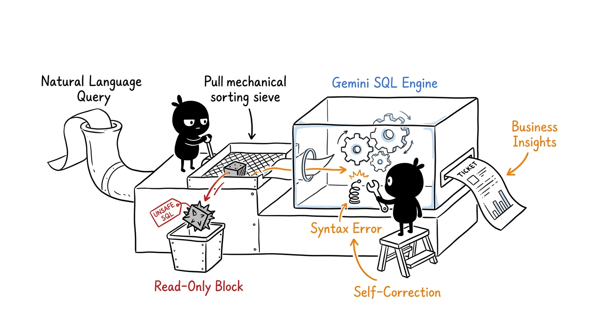
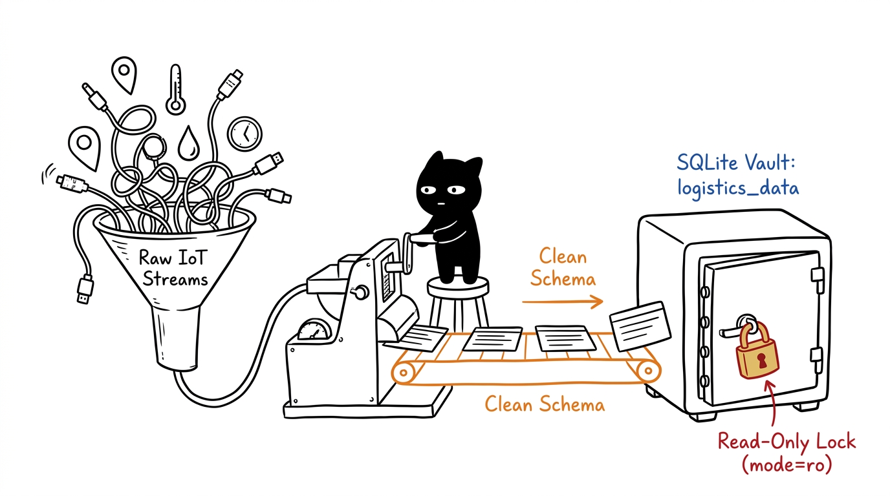
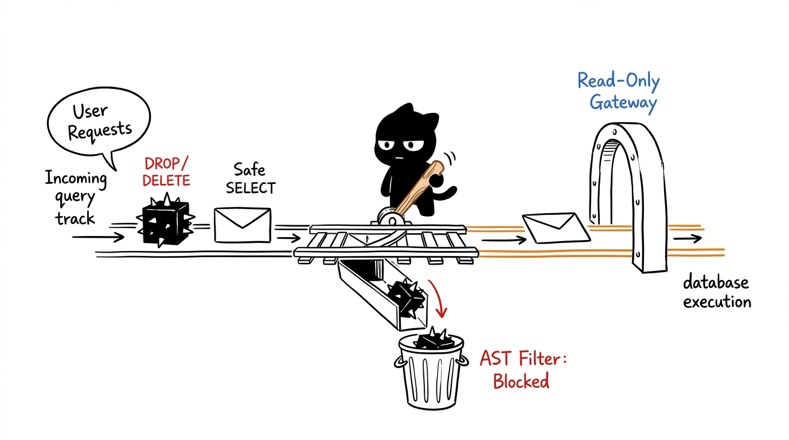
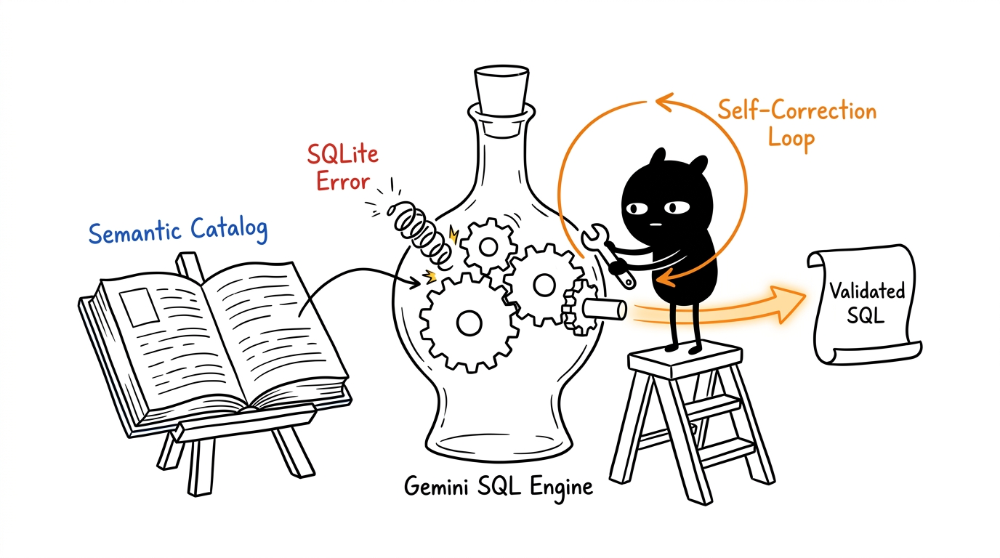
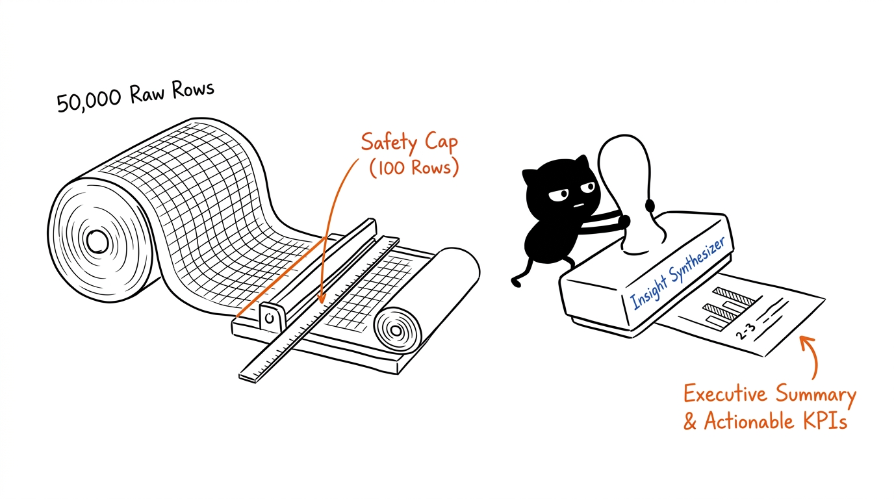

# 🤖 Tele-Tron-1

**Tele-Tron-1** is an autonomous **Natural Language to SQL (NL-to-SQL)** intelligence engine designed for supply chain and logistics analytics. Powered by **Google Gemini** models, **SQLite** with engine-level read-only security, and an interactive **Streamlit** dashboard.



---

## ✨ Features

- **Natural Language to SQL**: Translates complex logistics questions into precise SQLite queries.
- **Multi-Turn Conversational Memory**: Maintains conversational context across follow-up queries, allowing users to drill down into prior results seamlessly.
- **Dynamic Plotly Visualization & GPS Fleet Mapping**: Automatically renders interactive GPS vehicle maps on OpenStreetMap, time series trends, categorical bar charts, correlation scatter plots, and KPI metric cards.
- **Zero-Latency In-Memory Query Caching**: Instant retrieval of recurring queries at $0 LLM token cost with live cache purging controls.
- **Semantic Business Catalog**: Grounded domain dictionary mapping all 26 supply chain metrics, units, and executive categories for high accuracy.
- **Transparent Assumptions Callouts**: Explains business interpretations and threshold choices made by the model.
- **Automated Business Insights**: Synthesizes tabular results into executive summaries with key metrics, comparisons, and actionable insights.
- **Engine-Level Read-Only Security**: Uses SQLite URI `mode=ro` to guarantee that destructive queries (`DROP`, `DELETE`, `UPDATE`, `INSERT`, `ALTER`, etc.) cannot execute at the C-engine level.
- **AST / Token Safety Filter**: Pre-execution validation blocking stacked queries, administration commands, and multi-statement injection while avoiding false positives on substring matches.
- **Memory Safety Limits**: Automatically injects safety `LIMIT` caps to prevent unbounded queries from overwhelming memory or UI rendering.
- **Self-Correction Retry Loop**: Automatically passes SQLite syntax or schema errors back to Gemini for guided query correction.
- **Interactive Streamlit Web Dashboard**: Chat interface, schema explorer, semantic catalog viewer, interactive Plotly charts, GPS maps, and one-click CSV export.
- **Cached Schema Inspection**: In-memory caching of table metadata and column types via `PRAGMA table_info`.

---

## 🏗️ Architecture & Pipeline

Tele-Tron-1 processes user queries through a 4-stage pipeline illustrated below:

### 1. Data Ingestion: Sensor Chaos to Read-Only Vault

Raw IoT telemetry (GPS coordinates, cold-chain temperature readings, fuel burn rates) is normalized and secured inside SQLite behind an engine-level **Read-Only Lock (`mode=ro`)**.

### 2. Security Gatekeeper: Dual-Tier Query Protection

A mechanical AST token filter intercepts destructive keywords (`DROP`, `DELETE`, `UPDATE`) and dumps them into a blocked chute, while safe `SELECT` queries pass through the read-only engine gateway.

### 3. Query Generation: Semantic Catalog & Self-Correction

Gemini references the **Semantic Business Catalog** to translate business questions into SQLite syntax. If an error occurs, the self-correction loop catches it and dynamically repairs the query with a wrench.

### 4. Synthesis: Safety Limiter & Executive Summary

A safety limiter trims massive result sets (`LIMIT 100`) to protect client memory, and the **Insight Synthesizer** stamps out an executive summary ticket with key takeaways and mini visual charts.

> 📖 For detailed technical explanations of each stage, see [ARCHITECTURE.md](ARCHITECTURE.md).

---

## 🚀 Getting Started

### 1. Prerequisites
- Python 3.10+
- A Google Gemini API key ([Get an API key here](https://aistudio.google.com/))

### 2. Installation
Clone the repository and install dependencies:

```bash
git clone https://github.com/gauravkadam20/Tele-Tron-1.git
cd Tele-Tron-1
pip install -r requirements.txt
```

### 3. Configure Environment Variables
Create a `.env` file in the project root:

```env
GOOGLE_API_KEY="your-google-gemini-api-key"
GEMINI_MODEL="gemini-3.5-flash-lite"
```

*(Note: `.env` is listed in `.gitignore` and will never be committed to Git).*

### 4. Database Setup (Optional)
If you need to re-import the logistics dataset:

```bash
python Database/setup_db.py
```

---

## 🖥️ Running the Application

### Option A: Interactive Streamlit Web Dashboard
Launch the web UI:

```bash
# Recommended (works regardless of Windows PATH settings):
python -m streamlit run app.py

# Or directly if Streamlit is in your PATH:
streamlit run app.py
```

Open `http://localhost:8501` in your browser to start querying your data interactively.

### Option B: Command Line Interface
Run the demo script:

```bash
python main.py
```

---

## 🧪 Running Tests

The test suite covers safety guards, AST validation, CTE query support, read-only engine enforcement, and end-to-end question answering:

```bash
python test_askdata.py
```

---

## 📂 Project Structure

```
Tele-Tron-1/
├── .env                   # Local secrets (never committed)
├── .gitignore             # Git ignore configuration
├── requirements.txt       # Production dependencies
├── README.md              # Project documentation with illustrations
├── ARCHITECTURE.md        # Illustrated deep-dive guide
├── app.py                 # Streamlit web dashboard
├── askdata.py             # Core NL-to-SQL engine, safety checks & synthesizer
├── chart_engine.py        # Dynamic visualization & GPS fleet mapping engine
├── config.py              # Environment configuration & Gemini client factory
├── data_dictionary.py     # Semantic business catalog & domain metadata
├── main.py                # Command-line entrypoint demonstration
├── test_askdata.py        # Unit & integration test suite
├── docs/
│   └── assets/            # Hand-drawn architecture illustrations
├── Database/
│   ├── setup_db.py        # Ingestion script (CSV -> SQLite)
│   └── logistics.db       # SQLite database (git-ignored)
└── Data/
    └── Raw/               # Raw logistics CSV dataset (git-ignored)
```
